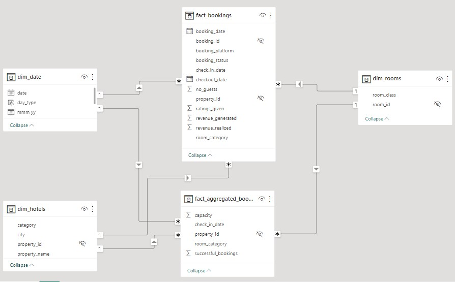

# AtliQ Grands Revenue Analysis

## Intrduction
Businesses face a period of growth and decline, and the hospitality industry is no exception. One thing is certain and phenomenal the hospitality industry lives and dies by its customers. Good customer service can be a revenue generator for a hotel. Focusing on small details can mean the difference between remaining stagnant or increasing profitability. 

This is a Power BI project that presents the analysis of hotel data for **AtliQ Grands Hotel**, from May 2022 to June 2022. This will enable us to gain insights into various aspects of hotel management, including customer ratings, occupancy rates, revenue, and bookings.

**_Disclaimer_**: _AtliQ Grands Hotel is an imaginary company and all the datasets are just mimicking real-life scenarios in a hospitality domain to demonstrate data visualization with Power BI._

## Problem Statement
AtliQ Grands owns multiple five-star hotels across India. They have been in the hospitality industry for the past 20 years. Due to strategic moves from other competitors and ineffective decision-making in management, AtliQ Grands are losing its market share revenue in the luxury/business hotels category. The following questions will enable us to gain insight into the revenue share of the company;

1. How much did we generate in the last three months? Show other key metrics that are helpful to the business.
2. Is there any significant difference in occupancy for weekends and weekdays? Does this have any impact on the pricing?
3. In terms of revenue generation, how has our revenue performed across the two room categories during this period?
4. Could you pull weekly trends for occupancy? We’ll like to see that concerning Revenue.
5. What are our best and least-performing properties in terms of revenue?
6. We have several booking platforms, can we see how they are all performing?
7. What about our properties in different cities, is their performance below par?
8. How is the occupancy over time? Look at the ratings as well.

## Skills Demonstrated
This project exposed me to learning a lot using Microsoft Power BI.
- Multiple complex DAX formulas and Functions.
- Calculated columns
- Data Extraction, Cleaning, and Transformation (ETL)
- Data Modelling
- Data Visualization
- Page Navigation
- Tooltips
- Using Bookmarks

## Data Sourcing
The dataset used for this analysis was collected from Code Basics’ website. You can access the dataset through this link

## Data Transformation
The dataset comprises five CSV(Comma Separated Values) files, three dimension tables, and two fact tables. The data was cleaned and transformed using Power Query in Power BI to ensure accuracy and consistency. Data cleaning steps involved;
- Correct data type for columns.
- Replaced incorrect dates with the correct date.
- Renamed field values.

## Data Modelling
The data model in Power BI consists of five tables:
1. **dim_date:** Contains full date information about dates including day type (weekend or weekday), month, and week number (W19 — W32).
2. **dim_hotels:** Stores a number that identifies the hotel, property name, category it belongs to (luxury/business), and the city it’s     located in. 
3. **dim_rooms:** Includes room id and room class. 
4. **fact_bookings:** Stores information about bookings including booking dates, booking platforms, number of guests, revenue, check-in, and checkout dates. 
5. **fact_aggregrated_bookings:** Includes successful bookings, hotel id, and capacity. The dimension tables (with the prefix “dim”) have a matching id in the fact tables (with the prefix “fact”). This modeling produces a one-to-many relationship.
***

## Visualization
The report comprises two pages:
1. Overview
2. Property Performance

You can interact with the report [here] ()
