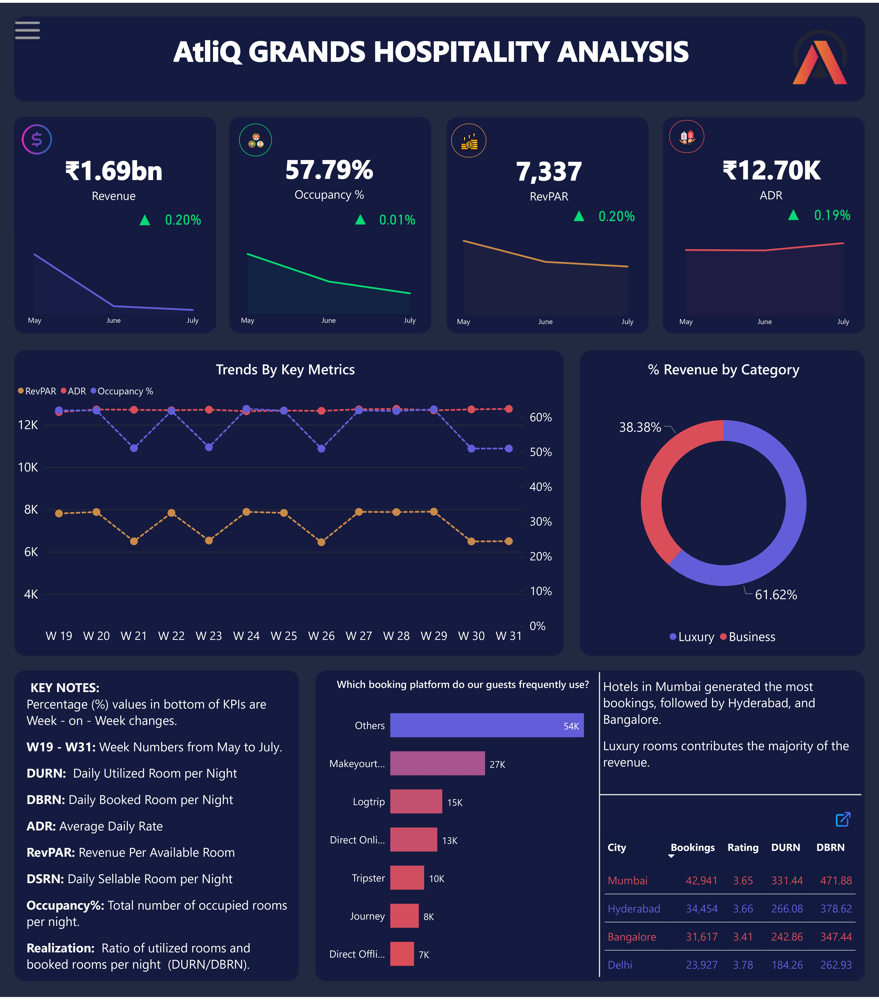
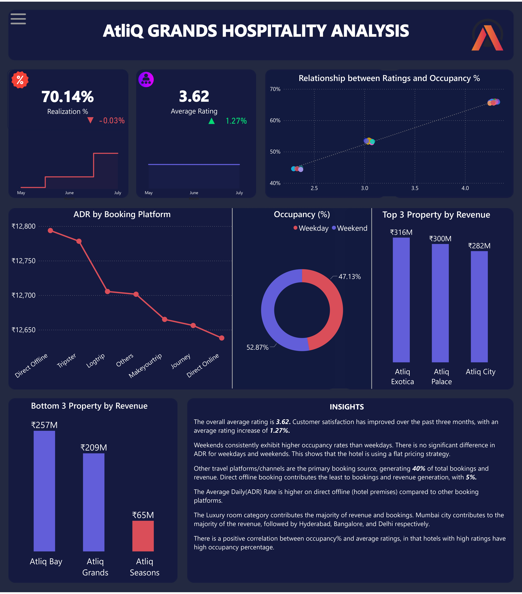

# AtliQ Grands Revenue Analysis

## Intrduction
Businesses face a period of growth and decline, and the hospitality industry is no exception. One thing is certain and phenomenal the hospitality industry lives and dies by its customers. Good customer service can be a revenue generator for a hotel. Focusing on small details can mean the difference between remaining stagnant or increasing profitability. 

This is a Power BI project that presents the analysis of hotel data for **AtliQ Grands Hotel**, from May 2022 to June 2022. This will enable us to gain insights into various aspects of hotel management, including customer ratings, occupancy rates, revenue, and bookings.

**_Disclaimer_**: _AtliQ Grands Hotel is an imaginary company and all the datasets are just mimicking real-life scenarios in a hospitality domain to demonstrate data visualization with Power BI._

## Problem Statement
AtliQ Grands owns multiple five-star hotels across India. They have been in the hospitality industry for the past 20 years. Due to strategic moves from other competitors and ineffective decision-making in management, AtliQ Grands are losing its market share revenue in the luxury/business hotels category. The following questions will enable us to gain insight into the revenue share of the company;

1. How much did we generate in the last three months? Show other key metrics that are helpful to the business.
2. Is there any significant difference in occupancy for weekends and weekdays? Does this have any impact on the pricing?
3. In terms of revenue generation, how has our revenue performed across the two room categories during this period?
4. Could you pull weekly trends for occupancy? We’ll like to see that concerning Revenue.
5. What are our best and least-performing properties in terms of revenue?
6. We have several booking platforms, can we see how they are all performing?
7. What about our properties in different cities, is their performance below par?
8. How is the occupancy over time? Look at the ratings as well.

## Skills Demonstrated
This project exposed me to learning a lot using Microsoft Power BI.
- Multiple complex DAX formulas and Functions.
- Calculated columns
- Data Extraction, Cleaning, and Transformation (ETL)
- Data Modelling
- Data Visualization
- Page Navigation
- Tooltips
- Using Bookmarks

## Data Sourcing
The dataset used for this analysis was collected from Code Basics’ website. You can access the dataset through this [link](https://codebasics.io/challenge/codebasics-resume-project-challenge)

## Data Transformation
The dataset comprises five CSV(Comma Separated Values) files, three dimension tables, and two fact tables. The data was cleaned and transformed using Power Query in Power BI to ensure accuracy and consistency. Data cleaning steps involved;
- Correct data type for columns.
- Replaced incorrect dates with the correct date.
- Renamed field values.

## Data Modelling
The data model in Power BI consists of five tables:
1. **dim_date:** Contains full date information about dates including day type (weekend or weekday), month, and week number (W19 — W32).
2. **dim_hotels:** Stores a number that identifies the hotel, property name, category it belongs to (luxury/business), and the city it’s     located in. 
3. **dim_rooms:** Includes room id and room class. 
4. **fact_bookings:** Stores information about bookings including booking dates, booking platforms, number of guests, revenue, check-in, and checkout dates. 
5. **fact_aggregrated_bookings:** Includes successful bookings, hotel id, and capacity. The dimension tables (with the prefix “dim”) have a matching id in the fact tables (with the prefix “fact”). This modeling produces a one-to-many relationship and depicts a star schema.
***

## Visualization
The report comprises two pages:
1. Overview
2. Property Performance

You can interact with the dashboard [here](https://app.powerbi.com/view?r=eyJrIjoiNDAzYmEyMmUtNDA1MC00ZGMwLThjNmMtZWIzZmNkNDE2ZWZmIiwidCI6ImM4N2JkODljLTlmOGMtNDJlNS05NzVkLWQ3ZWYwOWI2OTIxMiJ9)

Features:
- The **Menu Button**, when clicked, the top left corner displays the filters for the month, week number, room class, and navigation button to the Property Performance page while the  filter can be closed by clicking on the "X" button.
- The **Link Button** on top of the table visually displays the full table when clicked.
  
**_Key Notes_**
- Percentage (%) values at the bottom of KPIs are Week-on-Week changes.
- **RevPAR** - Revenue Per Available Room
- **DSRN** - Daily Sellable Room Nights/per night
- **ADR** - Average Daily Rate/Amount per room
- **DBRN** -Daily Booked Room Nights/per night
- **DURN** - Daily Booked Room Nights/per night
- **Realization%** - The ratio of utilized rooms and booked rooms per night
- **Occupancy%** - Total number of occupied rooms out of the available.

## Analysis

### Overview
- The business generated a revenue of 1.69 billion. 
- The occupancy rate across all locations is slightly above 50%,(57.79%). This means that on average, at least 50% of the rooms are utilized daily. 
- The average selling price for a room is 12.70K while RevPAR equals 7,337.
- RevPAR and Occupancy are fluctuating while ADR is constant.

### Property Performance

- There are more guests/customers during weekends (52.87% occupancy) than on weekdays (47.13%). Meanwhile, there's no significant difference in ADR and Realisation on weekdays or weekends.
- RevPar and Occupancy are fluctuating while ADR is constant. RevPar is a by-product of Occupancy, hence the reason for the fluctuation. A constant ADR shows the pricing is relatively fixed.

## Insights
- Over three months (May, June, and July) AtliQ Grands were able to generate a revenue of approximately 1.7 billion (1.69b). During this period, Revenue, ADR, occupancy, and RevPar increased from the latest previous week, except for realisation% which decreased by 0.03%.
- The overall average rating is 3.62. Customer satisfaction has improved over the past three months, with an average rating increase of 1.27%. Although some hotels have ratings lower than the average.
- Weekends consistently exhibit higher occupancy rates than weekdays. There is no significant difference in ADR for weekdays and weekends. This shows that the hotel is using a flat pricing strategy.
- Other travel platforms/channels are the primary booking source, generating 40% of total bookings and revenue. Direct offline booking contributes the least to bookings and revenue generation, with 5%.
- The Average Daily(ADR) Rate is higher on direct offline (hotel premises) compared to other booking platforms.
- The Luxury room category contributes the majority of revenue and bookings. Mumbai city contributes most of the revenue, followed by Hyderabad, Bangalore, and Delhi.
- There is a correlation between revenue and average ratings, in that ratings with high ratings tend to generate more revenue.

## Recommendations
- The rule of demand and supply and price elasticity is different for the travel, tourism, and hospitality industry. Therefore, the hotel should leverage dynamic pricing to increase revenue generation and increase prices for peak days and weekends.
- Consider differential pricing strategies for their offline booking platforms by implementing targeted marketing campaigns/promotions to boost bookings and in turn increase revenue.
- AtliQ Grands should pay more attention to customer reviews and ratings and focus on improving customer satisfaction further by addressing critical areas identified in customer reviews.
- Explore opportunities to increase direct bookings through the hotel's website to reduce dependence on other online platforms.

## Conclusion
The data analysis performed using Power BI has provided valuable insights into various aspects of hotel management for AtliQ Grands Hotel. The findings and recommendations can help optimize operations, enhance customer satisfaction, and drive revenue growth. Regular monitoring and analysis of key metrics will ensure continued success in the hotel.
